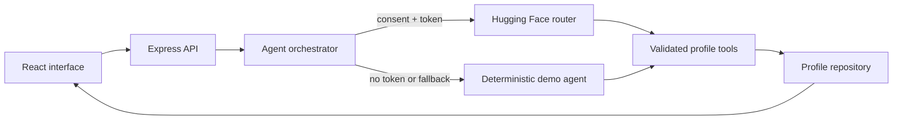

# Facet

**Careers, in full dimension.** Facet is an evidence-first conversational profile agent. It helps professionals turn lived experience into a clear profile, then gives hiring teams a grounded way to explore the evidence behind it.

Facet deliberately avoids the usual résumé pattern of collecting fields. The agent asks one adaptive question at a time, challenges vague claims, records structured evidence through tool calls, and leaves publication under the profile owner's control.

## What makes it different

- **Adaptive employee interview:** Follow-up questions respond to the last answer instead of following a static form.
- **Evidence over adjectives:** Skills are stored with context; achievements capture ownership and outcome.
- **Separate employer journey:** Published profiles can be searched and explored through profile-grounded Q&A.
- **Privacy by design:** Drafts never appear in search, hosted inference requires consent, and the token stays server-side.
- **Useful without an API key:** A deterministic demo agent makes both journeys immediately testable.
- **No model downloads:** Live AI uses a hosted Hugging Face Inference Provider.

## Quick start

Requirements: Node.js 20 or newer.

```bash
npm install
cp .env.example .env
npm run dev
```

Open `http://localhost:5173`. With no `HF_TOKEN`, Facet automatically runs in private demo mode.

To enable hosted intelligence, create a Hugging Face token with **Inference Providers** permission and add it to `.env`:

```env
HF_TOKEN=hf_...
HF_MODEL=openai/gpt-oss-120b:groq
```

No model weights are installed or downloaded. Calls go to `https://router.huggingface.co/v1` only after the user opts in.

## Product journeys

### Professional

1. Enter a name and choose whether to use hosted AI.
2. Answer focused questions about identity, achievements, scope, skills, and goals.
3. Watch the structured profile form beside the conversation.
4. Review and publish only when the evidence feels accurate.

### Hiring team

1. Search published profiles by role, skill, location, or evidence.
2. Read experience and skills in context.
3. Ask Facet Scout about strengths, gaps, or interview questions.
4. Receive profile-grounded answers, not autonomous hiring decisions.

## Architecture



The implementation intentionally uses a small orchestration layer rather than an agent framework. There are two tools and one durable domain model, so explicit control keeps the behavior easier to inspect, test, and secure. See [DESIGN.md](DESIGN.md) for the detailed rationale.

For a complete implementation report and step-by-step operating guide, see [docs/PROJECT_REPORT.md](docs/PROJECT_REPORT.md).

## Commands

| Command | Purpose |
| --- | --- |
| `npm run dev` | Run the API and Vite development server |
| `npm run build` | Type-check and create the production client |
| `npm start` | Serve the built application on port 8787 |
| `npm test` | Run unit and API tests |
| `npm run check` | Run types, lint, tests, and build |

## Docker

```bash
docker compose up --build
```

The container serves the complete app at `http://localhost:8787` and persists profiles in a named volume.

## Technology

- React 19, TypeScript, and Vite
- Express 5 with Zod validation, Helmet, and request limits
- Hugging Face's OpenAI-compatible hosted chat API
- Vitest and Supertest
- JSON repository with atomic writes (replaceable behind `ProfileStore`)

## Responsible use

Facet is an exploration tool, not an automated hiring system. It does not rank candidates, infer protected characteristics, or make employment decisions. Employer answers distinguish evidence from missing information. Review [SECURITY.md](SECURITY.md) before deploying with real personal data.

## License

[MIT](LICENSE) © 2026 Yasmin Tayebi
