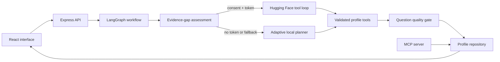

# Facet

**Careers, in full dimension.** Facet is an evidence-first conversational profile agent. It helps professionals turn lived experience into a clear profile, then gives hiring teams a grounded way to explore the evidence behind it.

Facet deliberately avoids the usual résumé pattern of collecting fields. The agent asks one adaptive question at a time, challenges vague claims, records structured evidence through tool calls, and leaves publication under the profile owner's control.

## What makes it different

- **Adaptive employee interview:** A LangGraph evidence-gap planner selects follow-ups from the actual conversation instead of following a static sequence.
- **Evidence over adjectives:** Skills are stored with context; achievements capture ownership and outcome.
- **Separate employer journey:** Published profiles can be searched and explored through profile-grounded Q&A.
- **Privacy by design:** Drafts never appear in search, hosted inference requires consent, and the token stays server-side.
- **Useful without an API key:** A local adaptive planner reacts to metrics, leadership, vague claims, skills, and missing evidence.
- **No model downloads:** Live AI uses a hosted Hugging Face Inference Provider.
- **MCP integration:** A read-only MCP server exposes published-profile search and evidence analysis to compatible clients.

## Quick start

Requirements: Node.js 20 or newer.

```bash
npm install
cp .env.example .env
npm run dev
```

Open `http://localhost:5173`. With no `HF_TOKEN`, Facet automatically runs in private adaptive mode.

To enable hosted intelligence, create a Hugging Face token with **Inference Providers** permission and add it to `.env`:

```env
HF_TOKEN=hf_...
HF_MODEL=openai/gpt-oss-120b:groq
```

No model weights are installed or downloaded. Calls go to `https://router.huggingface.co/v1` only after the user opts in.

## Product journeys

### Professional

1. Enter a name and choose whether to use hosted AI.
2. Answer focused questions about identity, achievements, scope, skills, and goals.
3. Watch the structured profile form beside the conversation.
4. Review and publish only when the evidence feels accurate.

### Hiring team

1. Search published profiles by role, skill, location, or evidence.
2. Read experience and skills in context.
3. Ask Facet Scout about strengths, gaps, or interview questions.
4. Receive profile-grounded answers, not autonomous hiring decisions.

## Architecture



LangGraph makes the interview workflow explicit: assess evidence, route to the appropriate reasoning path, execute validated tools, and check response quality. Its in-memory checkpointer keeps a thread-specific graph state. See [DESIGN.md](DESIGN.md) for the detailed rationale.

For a complete implementation report and step-by-step operating guide, see [docs/PROJECT_REPORT.md](docs/PROJECT_REPORT.md).

## Commands

| Command | Purpose |
| --- | --- |
| `npm run dev` | Run the API and Vite development server |
| `npm run mcp` | Start the read-only Facet MCP server over stdio |
| `npm run build` | Type-check and create the production client |
| `npm start` | Serve the built application on port 8787 |
| `npm test` | Run unit and API tests |
| `npm run check` | Run types, lint, tests, and build |

## Docker

```bash
docker compose up --build
```

The container serves the complete app at `http://localhost:8787` and persists profiles in a named volume.

## Technology

- React 19, TypeScript, and Vite
- Express 5 with Zod validation, Helmet, and request limits
- LangGraph with thread memory, conditional routing, and retry policy
- Hugging Face's OpenAI-compatible hosted chat API
- Model Context Protocol TypeScript SDK
- Vitest and Supertest
- JSON repository with atomic writes (replaceable behind `ProfileStore`)

## MCP server

Facet includes a standard MCP server for connecting compatible assistants and developer tools to published profile evidence. It provides:

- `search_published_profiles`
- `get_profile_evidence`
- `analyze_profile_evidence`
- `facet://methodology/evidence-first` resource

Start it with:

```bash
npm run mcp
```

Copy `mcp.json.example` and replace the placeholder paths with the absolute path to your clone. All MCP tools are read-only and exclude draft profiles.

## Responsible use

Facet is an exploration tool, not an automated hiring system. It does not rank candidates, infer protected characteristics, or make employment decisions. Employer answers distinguish evidence from missing information. Review [SECURITY.md](SECURITY.md) before deploying with real personal data.

## License

[MIT](LICENSE) © 2026 Yasmin Tayebi
