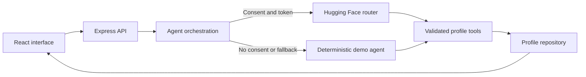

# Facet: Project Report and User Guide

**Project owner:** Yasmin Tayebi  
**Repository:** [github.com/YasminTayebi/facet-ai](https://github.com/YasminTayebi/facet-ai)  
**Report date:** October 3, 2026  
**Status:** Working prototype with passing CI

## Executive summary

Facet is an evidence-first conversational career-profile application. It replaces the usual résumé form with a guided interview that helps a professional explain what they did, why it mattered, and which skills produced the result. The same structured evidence becomes a focused exploration experience for hiring teams.

The product contains two clearly separated journeys:

1. **Professional journey:** a conversational agent builds a structured profile from the user's answers. The profile stays private until the user explicitly publishes it.
2. **Hiring-team journey:** employers search published profiles, review claims with supporting context, and ask questions that are answered only from the selected profile.

Facet can use hosted inference through Hugging Face without downloading model weights. It also includes a deterministic demo engine, so every important product flow works without an API token or usage charges.

## Product goals

The implementation was designed around five goals:

- Create a natural conversation instead of a static résumé questionnaire.
- Connect professional claims to concrete evidence.
- Keep the professional and employer experiences visibly distinct.
- Make privacy and user control part of the product flow.
- Deliver a prototype that is easy to run, inspect, test, and extend.

## What was implemented

### Professional experience

The professional starts by entering a name. Facet then asks one question at a time and progressively explores:

- Professional identity and the value the person creates
- A meaningful achievement
- Role, organization, period, and personal ownership
- Skills tied to evidence rather than unsupported keywords
- Desired next roles
- Location and working-style preferences

The interface displays the conversation and the emerging profile side by side. A completion indicator reflects evidence coverage rather than the number of messages. Drafts are private, and publication is disabled until the profile has meaningful coverage.

### Employer experience

The employer journey includes three seeded synthetic profiles so the product is immediately demonstrable. Employers can:

- Search by name, role, skill, location, preference, or evidence
- Filter by working style
- Review a professional summary
- Inspect experience and outcome statements
- Review skills together with their supporting context
- Ask Facet Scout questions about impact, strengths, missing information, and interview validation

Facet Scout is explicitly prevented from making hiring decisions or inferring protected characteristics. When the profile lacks evidence, it says so rather than inventing an answer.

### Demo mode

When no hosted API token is configured, or when the user does not consent to hosted processing, the application uses a deterministic demo agent. It guides the same profile-building stages and updates the same domain model.

Demo mode is intentionally identified in the interface. It is not presented as model intelligence. This provides a reliable presentation path while keeping the hosted integration optional.

## Agent and prompt strategy

The professional agent receives:

1. A stable interviewer policy
2. The current structured profile
3. A recent conversation window

The interviewer policy establishes the following behavior:

- Ask exactly one high-value question at a time.
- Adapt to the user's previous answer.
- Ask for a decision, action, constraint, or result when a claim is vague.
- Never invent employers, dates, titles, metrics, or skills.
- Avoid protected and irrelevant personal characteristics.
- Keep publication under the user's control.
- Use a structured tool whenever new profile facts are available.

The hosted model can call `update_profile`. Its arguments are parsed and validated with Zod before the application changes any data. A failed validation returns a tool error and does not mutate the profile.

After a successful tool call, the model receives a concise result and produces the next conversational response. This separates natural-language generation from state mutation and makes agent behavior easier to test and audit.

The employer prompt has a different role and policy. It receives only one published profile and the employer's question. It must remain grounded in that profile, label reasonable inference, identify missing evidence, and avoid autonomous employment decisions.

## Technical architecture



### Frontend

- React 19
- TypeScript
- Vite
- Responsive custom CSS
- Lucide icons

The frontend includes landing, onboarding, conversation, live-profile, talent-search, candidate-detail, and employer-Q&A views. Loading, error, empty, and fallback states are represented explicitly.

### Backend

- Express 5
- Zod request and tool validation
- Helmet security headers
- CORS support
- JSON request limits
- Basic in-memory request limiting

The backend exposes routes for health checks, profiles, employee sessions, messages, publication, and employer questions.

### Persistence

Profiles use a repository abstraction backed by a JSON file. Writes are serialized and atomic: data is written to a temporary file and then renamed into place. Employee conversation sessions remain in memory.

This is appropriate for a single-instance prototype. A production deployment should replace the file repository with an encrypted managed database and store sessions in a durable multi-instance service.

### Hosted inference

The default configuration uses:

```env
HF_BASE_URL=https://router.huggingface.co/v1
HF_MODEL=openai/gpt-oss-120b:groq
```

This is a hosted API integration. The application does not install or download model weights. Both the model and provider route are configurable through environment variables.

## Privacy and security work

The following safeguards were implemented:

- Draft profiles are excluded from public profile endpoints.
- Hosted processing requires a server token and affirmative user consent.
- The API token is never sent to the browser.
- `.env` files and stored profiles are excluded from Git.
- Message and request-body sizes are limited.
- Model tool arguments are validated before mutation.
- Employer Q&A loads the canonical published profile on the server.
- The agent is prohibited from requesting or inferring protected characteristics.
- The employer assistant does not rank candidates or make hiring decisions.
- A deployment security checklist is included in `SECURITY.md`.

Hosted processing can include professional personal information such as names, employers, locations, achievements, and conversation messages. The user sees a consent control before this information is sent to the configured provider.

## Verification completed

The project includes automated coverage for:

- Profile initialization and completion calculation
- Validated tool-based profile updates
- Demo conversation progression
- Employer answers grounded in profile evidence
- Employee session creation
- Conversation and profile updates
- Published-profile search
- Rejection of incomplete publication
- Prevention of draft exposure in employer flows

The final quality gate runs:

```bash
npm run typecheck
npm run lint
npm test
npm run build
```

At delivery:

- 10 automated tests passed.
- The production client built successfully.
- The production server passed an HTTP smoke test.
- The production dependency audit reported zero known vulnerabilities.
- GitHub Actions completed successfully on `main`.

## How to run Facet

### 1. Clone the repository

Open Terminal:

```bash
cd /Users/yasmin/Projects
git clone https://github.com/YasminTayebi/facet-ai.git
cd facet-ai
```

This creates a permanent local copy that is independent of any other project.

### 2. Install the dependencies

```bash
npm install
```

Node.js 20 or newer is required.

### 3. Start in demo mode

```bash
npm run dev
```

Open [http://localhost:5173](http://localhost:5173).

No API token is needed. The application will identify itself as using the guided demo agent.

### 4. Use the professional journey

1. Select **Build my profile**.
2. Enter a full name.
3. Leave hosted AI disabled to use demo mode, or enable it after configuring a token.
4. Answer one question at a time.
5. Use **Try a sample answer** when demonstrating the product quickly.
6. Watch the live profile panel update.
7. Continue until the completion score reaches at least 50%.
8. Select **Publish profile** when the information is accurate.

Publishing makes the profile visible in the application's employer search. It does not publish a separate webpage on the internet.

### 5. Use the employer journey

1. Select **Explore talent**.
2. Search for a role, skill, location, or outcome.
3. Use the working-style filters if needed.
4. Select a profile from the left panel.
5. Review the summary, experience, evidence, and skills.
6. Ask Facet Scout a suggested question or write a custom question.

In demo mode, Scout uses a deterministic evidence-grounded response. With hosted AI configured, select the hosted-AI consent control before sending a question.

## How to enable hosted AI

Create a Hugging Face access token with Inference Providers permission. Never place the token in GitHub or share it in chat.

Create a local configuration file:

```bash
cp .env.example .env
```

Edit `.env`:

```env
HF_TOKEN=hf_your_private_token
HF_MODEL=openai/gpt-oss-120b:groq
HF_BASE_URL=https://router.huggingface.co/v1
ALLOW_DEMO_FALLBACK=true
PORT=8787
```

Restart the development server after changing `.env`:

```bash
npm run dev
```

The hosted agent is used only when the token exists and the user selects the consent option. If the hosted request fails and fallback is enabled, the session changes to guided demo mode.

## Production use

Build and run directly:

```bash
npm run build
npm start
```

Open [http://localhost:8787](http://localhost:8787).

Or use Docker:

```bash
cp .env.example .env
docker compose up --build
```

The Docker application is also available at [http://localhost:8787](http://localhost:8787). Docker Compose stores profiles in a named volume.

## Useful development commands

| Command | Purpose |
| --- | --- |
| `npm run dev` | Start the API and frontend development servers |
| `npm test` | Run automated tests |
| `npm run typecheck` | Validate TypeScript types |
| `npm run lint` | Run static code checks |
| `npm run build` | Create the production client |
| `npm run check` | Run the complete quality gate |
| `npm start` | Serve the production build |

## Current limitations

The prototype intentionally does not yet include:

- User authentication
- Tenant or organization isolation
- Profile ownership authorization
- Account-level export and deletion workflows
- A managed production database
- Distributed rate limiting
- Administrative moderation tools

The project should therefore be demonstrated locally or with synthetic data until those controls are implemented.

## Recommended next steps

For a production evolution, the recommended order is:

1. Add authentication and profile ownership.
2. Add Postgres with encrypted storage and migrations.
3. Add profile editing, export, and deletion.
4. Add evaluation cases for follow-up-question quality and factual extraction.
5. Add provider-level observability, cost limits, and retry policies.
6. Add role-specific employer workspaces without automated ranking.
7. Add deployment-specific privacy notices and retention controls.

## Conclusion

Facet demonstrates a complete agentic product loop rather than a chat interface alone: conversation produces validated structured state, that state drives a separate user journey, and privacy controls determine when data becomes visible or leaves the server. The project can be demonstrated immediately in demo mode and upgraded to hosted model intelligence with one environment variable and explicit user consent.
